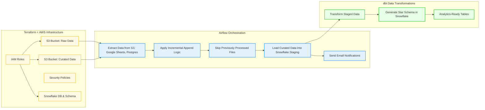
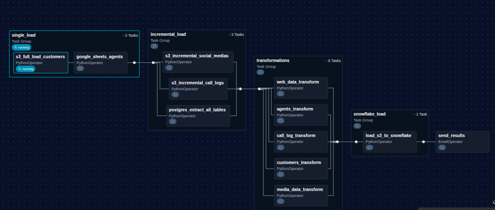

# Coretelecoms ETL Data Pipeline

## Overview

CoreTelecoms, a major telecom provider in the United States, is facing increasing customer churn due to unresolved and poorly managed complaints. The organization receives thousands of complaints daily from multiple sources such as call logs, social media, website forms, and customer care centers. However, due to inconsistent formats, siloed teams, and manual reporting processes, insights are delayed and customer retention continues to decline.

The project implements a unified data engineering pipeline that automates ingestion, storage, and processing of all customer complaint sources into Snowflake, enabling analytics and reporting from a single trusted dataset. The pipeline eliminates manual bottlenecks and creates a foundation for real-time monitoring, customer service optimization, and churn reduction.

---

## Data Sources

| Source                  | Description                                                                     | Format        | Location           | Frequency |
| ----------------------- | ------------------------------------------------------------------------------- | ------------- | ------------------ | --------- |
| Customers               | Customer information: ID, name, contact, location, etc.                         | CSV           | AWS S3             | Static    |
| Agents                  | Customer care agent lookup table                                                | Google Sheets | Google Drive       | Static    |
| Call Center Logs        | Daily logs with complaint type, agent handling, resolution status, and duration | CSV           | AWS S3             | Daily     |
| Social Media            | Online complaints containing customer/agent-related metadata                    | JSON          | AWS S3             | Daily     |
| Website Complaint Forms | Customer-submitted forms containing complaint records                           | Table         | AWS Postgres (RDS) | Daily     |

### Processing Behavior

Daily datasets uploaded to S3 may contain multiple files per source. Files are merged using append logic and then loaded into Snowflake. Static dataset sources (Google Sheets and Customers CSV) are loaded once via dedicated tasks in Airflow.

---

## Technologies Used

### Cloud and Storage

* AWS S3
* AWS IAM
* AWS SSM Parameter Store
* AWS Postgres (Transactional DB)
* Subnets and Subnet groups
* AWS Secret MAnager

### Data Warehouse

* Snowflake

### Pipeline Orchestration

* Apache Airflow

### Infrastructure Creation and Deployment

* Terraform

### Programming and Libraries

* Python
* boto3
* pandas
* pyarrow
* snowflake-connector-python

---

## Pipeline Features

* Automatic folder-level processing of S3 data
* Daily scheduled ingestion orchestrated with Airflow
* Incremental loading and prevention of duplicate loads
* Append logic for merging daily batch files
* Multi-source extraction (S3, Google Sheets, Postgres)
* Automated table creation in Snowflake
* Schema inference for dynamic loading
* Fully automated IAM and Snowflake configuration with Terraform
* Logging and monitoring
* Email notifications for pipeline success and failure using Gmail SMTP

---

## Architecture Summary

The pipeline currently follows the sequence below:

1. Terraform provisions AWS infrastructure including:

   * IAM roles
   * S3 buckets
   * Security policies
   * Snowflake storage integration, database, and schema
2. Airflow orchestrates ETL tasks:

   * Extracts data from S3, Google Sheets, and Postgres
   * Applies incremental append logic
   * Detects and skips previously processed files
   * Loads curated data into Snowflake staging
   * Sends email notifications on failure or pipeline completion
3. dbt transforms raw data into facts and dimensions for analytics:

   * Generates Star Schema in Snowflake
   * Provides clean, analysis-ready tables

---

### Architecture Diagram



---

## Snowflake Configuration

Deployed through Terraform:

* **Database** `CORETELECOM_DB`
* **Schema** `CORETELECOM_STAGING`
* **Warehouse** `CORETELECOMM_WH`
* **Storage Integration** 
* **AWS IAM Role** 

All Snowflake stages, roles, and schema configurations are automatically generated by Terraform within `aws_infrastructure/snowflake.tf`.

---

## Airflow Data Pipeline

### DAG Name

`core_etl_pipeline`



### Primary Tasks

```
single_load
incremental_load
transformations
snowflake_load
```

### Email Alerts

Airflow DAGs are configured to send email notifications using Gmail SMTP:
For the failure of the dag at any point an email will be sent with the failure logs, while after a successful run, at the end of the process, an email will be sent to confirm the success

* **Failure Notification**

```python
from airflow.providers.smtp.operators.smtp import EmailOperator

failure_email = EmailOperator(
    task_id='notify_failure',
    to='your_email@gmail.com',
    subject='CoreTelecoms ETL Pipeline — FAILED',
    html_content='The ETL pipeline has failed. Please check the Airflow logs for details.'
)
```

* **Success Notification**

```python
success_email = EmailOperator(
    task_id='notify_success',
    to='your_email@gmail.com',
    subject='CoreTelecoms ETL Pipeline — SUCCESS',
    html_content='All pipeline tasks completed successfully.'
)
```

SMTP configuration in `airflow.cfg` or via Airflow connections:

```
smtp_host = smtp.gmail.com
smtp_starttls = True
smtp_ssl = False
smtp_user = your_email@gmail.com
smtp_password = your_app_password
smtp_port = 587
smtp_mail_from = your_email@gmail.com
```

---

### Directory Structure

```
Airflow/ dags/
│  └ pipeline.py
│
│── plugins/
│   ├── google_sheet_load.py
│   ├── customer_load.py
│   ├── postgres_extract.py
│   ├── s3_incremental_copy.py
│   ├── s3_to_snowflake.py
│   └── utilities.py
```


The DAG orchestrates an end-to-end data ingestion and transformation pipeline. It extracts data from multiple source systems (S3, Google Sheets, and RDS), standardizes and converts all data into Parquet format, stores it in a centralized raw S3 bucket, applies dataset-specific transformations, and finally loads the processed data into **Snowflake staging tables** for downstream analytics and dbt transformations. The pipeline is organized into logical **task groups** to improve readability, scalability, and maintainability.


### 1. Single Load Task Group

The **Single Load** task group handles datasets that require a one-time or full extraction from their respective sources.

#### a. Customers – Full Load from S3
- Customer data is sourced from an external **AWS S3 bucket** where it originally arrives in **CSV format**.
- The DAG extracts the data and converts it into **Parquet format**.
- Converted files are stored in the project’s **raw S3 bucket**.
- This ensures consistent data formats and optimized storage for downstream processing.

#### b. Agents – Google Sheets Extraction
- Agent data (agent lists and details) is extracted from **Google Sheets**.
- The data is converted into **Parquet format** during extraction.
- The output is stored in the project’s **raw S3 bucket**, aligned with the pipeline’s storage standards.


### 2. Incremental Load Task Group

The **Incremental Load** task group processes datasets that are updated regularly and must be ingested incrementally.

#### a. Social Media Complaints – Incremental S3 Load
- Social media complaints data is sourced from an **S3 bucket** and arrives in **JSON format**.
- The data contains online complaints along with relevant metadata.
- New files are uploaded daily to the source bucket.
- The DAG processes only new files incrementally, converts them to **Parquet format**, and stores them in the project’s **raw S3 bucket**.

#### b. Call Center Logs – Incremental S3 Load
- Call center logs are sourced from S3 as **daily CSV files**.
- The DAG iterates over incoming files daily and checks whether a file has already been processed using the **file name** as a reference.
- Previously loaded files are skipped.
- New files are converted to **Parquet format** and stored in the project’s **raw S3 bucket**.

#### c. Website Complaints – Incremental RDS Extraction
- Website complaint data resides in an **RDS database table**.
- The DAG extracts new records incrementally on a daily basis.
- Extracted data is written as **Parquet files** into the project’s **raw S3 bucket**.


### 3. Transformations Task Group

The **Transformations** task group applies dataset-specific cleaning and standardization.

- Each dataset (customers, agents, social media, call logs, and website complaints) is transformed independently.
- Transformations include:
  - Standardizing table structures
  - Normalizing column names to be separated with underscores.
- All transformed datasets remain in **Parquet format**.
- The output of this task group is curated data ready for warehouse loading.


### 4. Snowflake Load Task Group

- Transformed Parquet files are loaded from S3 into **Snowflake staging tables**.
- This stage acts as the handoff point between Airflow and downstream analytics workflows.
- Further transformations are performed using **dbt**, which operates outside the Airflow pipeline.


---

## Terraform Infrastructure Layout

```
aws_infrastructure/
│── main.tf
│── iam.tf
│── s3_buckets.tf
│── secret_manager.tf
│── security_groups.tf
│── subnets.tf
│── subnet_groups.tf
│── snowflake.tf
```

This provisions the entire environment including networking, IAM roles, secret storage, S3 buckets, Postgres access, and Snowflake cloud resources.
## File Descriptions

#### `iam.tf`

* Defines a dedicated **IAM user for Apache Airflow**.
* Generates:
  * Access key
  * Secret access key
* Attaches an IAM policy granting **read and write access** to the specified **raw data S3 bucket**.
* Enables Airflow to:
  * Read source data
  * Write processed and converted Parquet files
* Access is scoped to the required bucket only, following the **principle of least privilege**.


#### `main.tf`

* Serves as the **core Terraform configuration file**.
* Configures a **remote Terraform backend** using an **S3 bucket** to store Terraform state files.
  * Ensures state is centralized and not stored locally.
* Defines the **Snowflake provider configuration**, enabling Terraform to manage Snowflake resources alongside AWS infrastructure.


#### `secret_manager.tf`

* Manages secrets using **AWS Secrets Manager**.
* Stores **Google Cloud service account credentials** used for:
  * Accessing Google Sheets
* Ensures sensitive credentials are:
  * Securely stored
  * Not hardcoded in the codebase
  * Retrieved securely by Airflow at runtime


#### `security_groups.tf`

* Creates and manages AWS security groups to control network access.
* Includes security groups for:
  * Airflow web server
  * Database resources
* Defines:
  * Inbound and outbound traffic rules
  * VPC-level access controls
* Ensures secure communication between Airflow, databases, and other AWS services.


#### `subnets.tf`

* Creates VPC subnets across two Availability Zones.
* Provides:
  * Network isolation
  * High availability for deployed resources
* Subnets are associated with the specified VPC.


#### `subnet_groups.tf`

* Defines **database subnet groups**.
* Used to control where database resources are deployed within the VPC.
* Ensures databases run only within approved subnets created across multiple Availability Zones.


#### `snowflake.tf`

* Provisions and manages **Snowflake infrastructure** using Terraform.
* Includes:
  * Snowflake user role
  * IAM policy for the Snowflake role
  * Storage integration between Snowflake and S3
  * Snowflake database and schema
  * File format definitions
  * External stage configuration for loading data from S3
* Enables secure and scalable data ingestion from S3 into Snowflake.

---

## dbt Models (Facts and Dimensions)

The analytics layer transforms raw data from Snowflake staging into clean, analysis-ready tables within the database.

### Fact Tables

| File                               | Resulting Table                | Description                                                              |
| ---------------------------------- | ------------------------------ | ------------------------------------------------------------------------ |
| `fact_call_center_logs.sql`        | `fact_call_center_logs`        | Phone-based customer complaints including agent handling and resolution. |
| `fact_social_media_complaints.sql` | `fact_social_media_complaints` | Complaints from social platforms with sentiment and user details.        |
| `fact_web_complaints.sql`          | `fact_web_complaints`          | Complaints submitted via website forms stored in Postgres.               |

### Dimension Tables

| File                | Resulting Table | Description                                                |
| ------------------- | --------------- | ---------------------------------------------------------- |
| `dim_customers.sql` | `dim_customers` | Standardized customer demographics and identifiers.        |
| `dim_agents.sql`    | `dim_agents`    | Standardized customer care agent information and metadata. |

---

## CI/CD Pipeline

This part of the project follows a **DataOps CI/CD approach** for infrastructure, ETL, and analytics models. This ensures only validated DAGs, Terraform plans, and dbt models are merged. CD deploys infrastructure, runs ETL pipelines, and updates warehouse models automatically.

| Component                         | CI (Checks Before Merge)                  | CD (Deployment)                           |
| --------------------------------- | ----------------------------------------- | ----------------------------------------- |
| Airflow (DAGs + Plugins)          | Lint and test Python DAGs                 | Upload DAGs to MWAA S3 bucket             |


---

## Docker & Docker Compose Overview

This setup uses a custom Docker image (`coretelecoms-etl:latest`) and docker-compose to provide a full ETL and data workflow environment. The 
volumes sync local project files with containers to maintain up-to-date code.:

1. **Terraform container**

   * Provisions AWS infrastructure
   * Commands: `terraform plan` and `terraform apply`
2. **Airflow container**

   * Runs DAGs to orchestrate ETL pipelines
   * Sends email notifications
3. **dbt container**

   * Transforms Snowflake staging data into facts and dimensions
   * Commands: `dbt run --project-dir /opt/project/dbt`


---

## Usage

Start services:

```bash
docker-compose up -d
```

Access Airflow UI:

```
http://localhost:8080
```

Run dbt models:

```bash
docker-compose exec dbt dbt run --project-dir /opt/project/dbt
```

Run Terraform commands:

```bash
docker-compose exec terraform terraform plan
docker-compose exec terraform terraform apply
```

---

## Summary
This project delivers a **comprehensive, end-to-end ETL pipeline** for processing telecom customer complaints from multiple sources into a unified Snowflake data warehouse. The system integrates multiple technologies to automate extraction, transformation, and loading of raw data into a structured, analysis-ready format, ensuring scalability and reliability.

Key highlights:

* **Automated Multi-Source Ingestion:** Extracts data from S3, Google Sheets, and Postgres, handling both static and incremental datasets.
* **Incremental and Duplicate-Safe Loading:** Uses append logic and file tracking to prevent redundant loads.
* **Airflow Orchestration:** DAGs handle task dependencies, scheduling, and error handling, including **email notifications** for failures and successful pipeline completion.
* **Terraform Infrastructure Automation:** Automatically provisions AWS resources (IAM roles, S3 buckets, security groups) and Snowflake cloud infrastructure (databases, schemas, storage integration).
* **Snowflake Data Warehouse:** Centralized staging and modeled tables, enabling fast analytics and reporting.
* **dbt Analytics Layer:** Transforms raw staging data into facts and dimensions, following a star schema model for robust analysis.
* **CI/CD Integration:** Validates Terraform, Airflow DAGs, and dbt models before merging, ensuring high-quality, production-ready deployments.
* **Containerized Workflow:** Docker Compose provides a reproducible environment for development, testing, and deployment, keeping Airflow, dbt, and Terraform isolated but synchronized with local code.

---

## Future Improvements

While the current implementation is production-ready, several enhancements can further improve scalability, efficiency, and analytics capabilities:

1. **Enhanced Monitoring & Alerting:**

   * Integrate Airflow with monitoring tools such as **Prometheus**, or **CloudWatch** to provide real-time visibility on DAG performance and resource usage.
   * Include Slack or Teams notifications alongside email for faster incident response.

2. **Data Quality Checks:**

   * Implement automated **data validation** and anomaly detection within the ETL process (e.g., schema validation, null value checks, or outlier detection).

3. **Dynamic Source Handling:**

   * Introduce modular extraction operators to support new sources easily.

4. **Incremental dbt Models:**

   * Implement **incremental models** for large fact tables to improve transformation performance and reduce processing time.

5. **Scalability Improvements:**

   * Split Airflow workloads into multiple workers for parallel execution.
   * Use Snowflake clustering or materialized views to improve query performance on large datasets.

